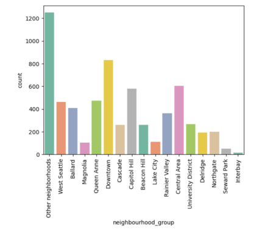

# [Project 1: Wine Quality Classification](https://github.com/Samir4569/Wine-Quality-Classification)
* Developed a model to classify wine quality using binary classification.
* Preprocessed data by handling missing values, encoding variables, and scaling features.
* Conducted exploratory data analysis (EDA) to understand distributions and visualized key insights.
* Built and evaluated k-nearest neighbor and Random Forest models, selecting the best performer.
* Achieved a Random Forest model accuracy of 0.8277, with detailed classification metrics provided.

# [Project 2: Airbnb Analysis](https://github.com/Samir4569/Airbnb_analysis)
I analyzed neighborhood trends in Seattle, focusing on availability, prices, and visitor behaviors. The data was preprocessed by converting date formats, handling missing values, and encoding availability. I examined how new visitors impact availability and identified key months with high visitor influx. Additionally, I performed sentiment analysis on visitor reviews to extract the most frequent keywords associated with each neighborhood.

